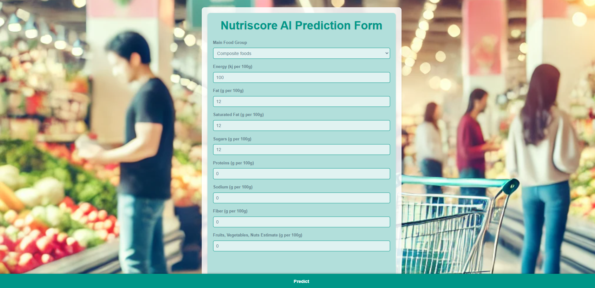
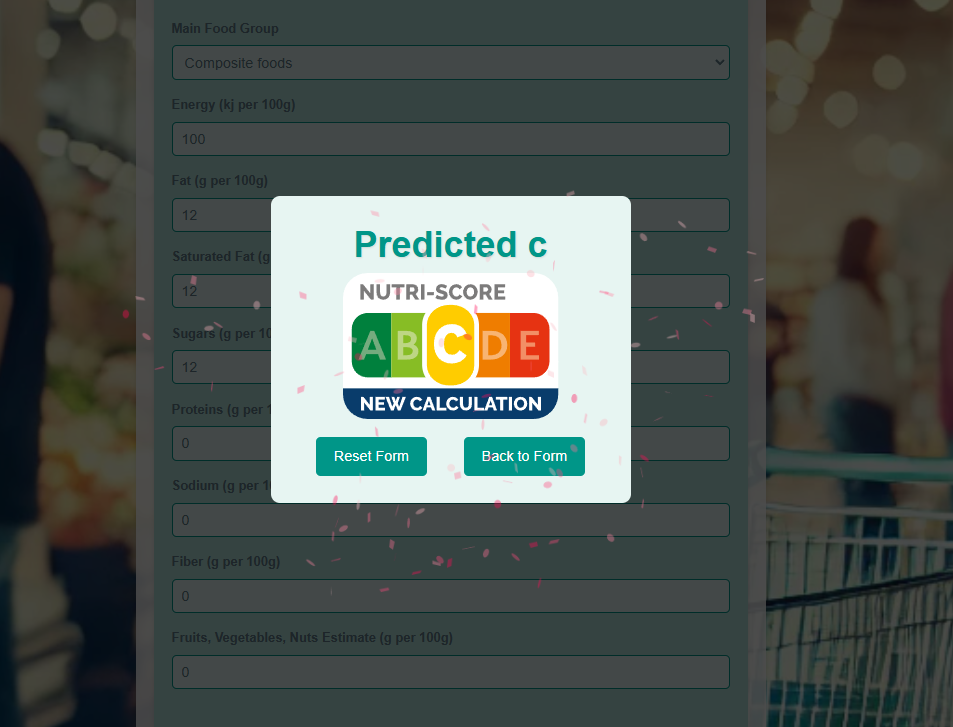

# Nutri-Score Prediction Project

Ce projet permet de prédire le Nutri-Score d'un produit alimentaire en fonction de ses informations nutritionnelles. Il fournit une interface utilisateur pour entrer les informations du produit et voir le Nutri-Score prédit. Le projet inclut également une API pour effectuer des prédictions de Nutri-Score.

## Fonctionnalités

- **Formulaire de prédiction** : Entrer les informations nutritionnelles pour obtenir un Nutri-Score prédit.
- **Affichage du résultat** : Voir le Nutri-Score sous forme d'image et de texte.
- **API de prédiction** : Faire des prédictions via une requête API.

## Capture d'écran

### Formulaire de prédiction



### Résultat de prédiction



## Installation

1. Clonez le dépôt :

   ```bash
   git clone git@github.com:TheSmartisen/nutriscore-prediction.git
   cd nutriscore-prediction
   ```

2. Installez les dépendances :

   ```bash
   pip install -r requirements.txt
   ```

3. Exécutez l'application :

   ```bash
   python run.py
   ```

## Utilisation de Docker

Ce projet est configuré pour être exécuté dans un environnement Docker. Voici les étapes pour construire et exécuter le projet dans des conteneurs Docker.

### Prérequis

Assurez-vous d'avoir Docker et Docker Compose installés sur votre machine.

### Étapes pour exécuter l'application avec Docker

1. **Construire l'image Docker** :

   Depuis la racine du projet, exécutez la commande suivante pour construire l'image Docker :

   ```bash
   docker-compose build
   ```

2. **Exécuter l'application** :

   Une fois l'image construite, lancez l'application avec Docker Compose :

   ```bash
   docker-compose up
   ```

   Cela démarrera le conteneur `web` et montera le dossier local `./data` dans le conteneur sous `/data`, permettant de sauvegarder les données de prédiction de manière persistante.

3. **Accéder à l'application** :

   L'application sera accessible depuis votre navigateur à l'adresse suivante :

   ```
   http://localhost:5000
   ```

### Fichiers Docker

- **Dockerfile** : Définit l'image Docker pour le projet, en installant les dépendances et en configurant l'application pour qu'elle puisse être exécutée dans un conteneur.
- **docker-compose.yml** : Définit le service `web` avec un volume monté pour la persistance des données et des variables d'environnement pour configurer le chemin des données.
- **.dockerignore** : Liste les fichiers et dossiers à ignorer lors de la création de l'image Docker afin de réduire sa taille et d'optimiser le processus de build.

---

### Exemple de Dockerfile

Le `Dockerfile` configure l'image pour exécuter une application Flask. Voici le contenu de base de votre fichier :

```Dockerfile
# Utilise une image Python officielle
FROM python:3.8-slim

# Définit le répertoire de travail
WORKDIR /app

# Copie le fichier requirements et installe les dépendances
COPY requirements.txt .
RUN pip install -r requirements.txt

# Copie le reste des fichiers du projet dans le conteneur
COPY . .

# Définit la commande par défaut
CMD ["flask", "run", "--host=0.0.0.0", "--port=5000"]
```

### Exemple de docker-compose.yml

Le fichier `docker-compose.yml` configure le service pour que le conteneur de l'application Flask puisse accéder aux données via un volume monté :

```yaml
version: '3.8'

services:
  web:
    build: .
    container_name: nutriscore_prediction
    ports:
      - "5000:5000"
    volumes:
      - ./data:/data  # Volume pour sauvegarder les données de prédiction
    environment:
      - DATA_PATH=/data/requests  # Chemin du dossier de sauvegarde des données dans le conteneur
    command: flask run --host=0.0.0.0 --port=5000
```

### .dockerignore

Le fichier `.dockerignore` exclut les fichiers inutiles pour le conteneur afin de garder l'image légère. Exemple de `.dockerignore` :

```
__pycache__
*.pyc
*.pyo
*.pyd
.env
data/
```

En suivant ces instructions, vous pourrez facilement construire et exécuter l'application en utilisant Docker. Cela garantit un environnement stable et reproductible pour le projet Nutri-Score Prediction.

## Utilisation

Accédez à `http://localhost:5000` dans votre navigateur pour utiliser l'interface utilisateur et prédire un Nutri-Score.

### API

L'API de prédiction est disponible à l'URL suivante :

**Endpoint** : `/api/v1/predict-nutriscore`

**Méthode** : `POST`

**Données d'entrée** (JSON) :
```json
{
    "pnns_groups_1": "Beverages",
    "energy_100g": 42.0,
    "fat_100g": 0.0,
    "saturated_fat_100g": 0.0,
    "trans_fat_100g": 0.0,
    "cholesterol_100g": 0.0,
    "carbohydrates_100g": 10.6,
    "sugars_100g": 10.6,
    "fiber_100g": 0.0,
    "proteins_100g": 0.0,
    "salt_100g": 0.01,
    "sodium_100g": 0.004,
    "calcium_100g": 0.0,
    "iron_100g": 0.0,
    "fruits_vegetables_nuts_estimate_from_ingredients_100g": 0.0
}
```

**Exemple de réponse** :
```json
{
    "predicted_score": "B"
}
```

## Licence

Ce projet est sous licence MIT. Voir le fichier [LICENSE](LICENSE) pour plus de détails.
